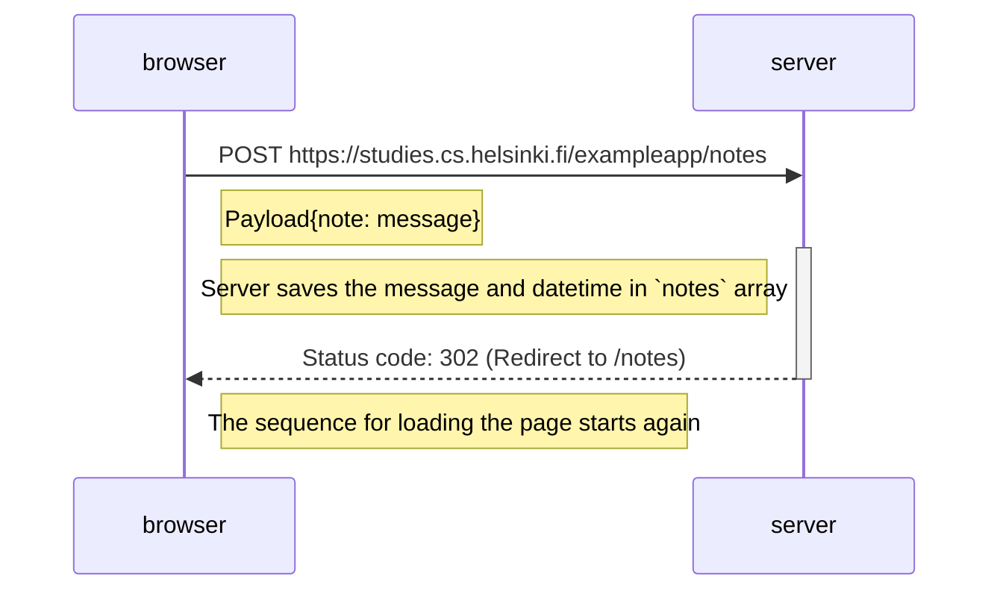

```mermaid
sequenceDiagram
    participant browser
    participant server

    browser->>server: POST https://studies.cs.helsinki.fi/exampleapp/notes
    Note right of browser: Payload{note: message}
    activate server
    Note left of server: Server saves the message and datetime in `notes` array
    server-->>browser: Status code: 302 (Redirect to /notes)
    deactivate server
    Note right of browser: The sequence for loading the page starts again
```
