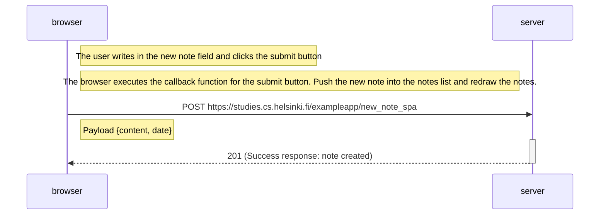

```mermaid
sequenceDiagram
    participant browser
    participant server

    Note right of browser: The user writes in the new note field and clicks the submit button
    Note right of browser: The browser executes the callback function for the submit button. Push the new note into the notes list and redraw the notes.
    browser->>server: POST https://studies.cs.helsinki.fi/exampleapp/new_note_spa
    Note right of browser: Payload {content, date}
    activate server
    server-->>browser: 201 (Success response: note created)
    deactivate server
```
